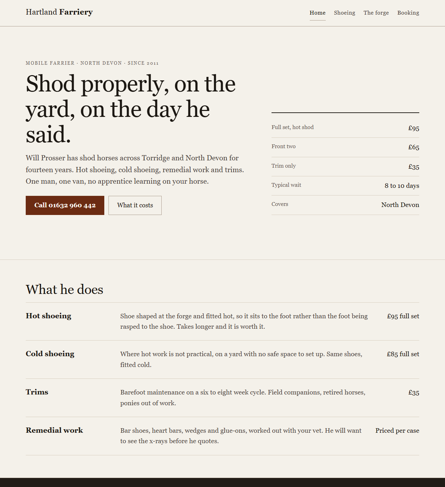

# website-builder

**Websites that look made, not generated.**

A folder of markdown, a zero-dependency checker, and (on Claude Code) working hook
enforcement, that together make an AI coding agent build the website in *your* head —
instead of the website it builds for everyone.

No install. No framework. No account. Works with **Claude Code, Codex CLI, Cursor, Gemini
CLI, Grok CLI, Windsurf, Cline** — or a person with a text editor.

```bash
git clone https://github.com/TVALOUR/website-builder
cd website-builder
# open your coding agent here and say: "build me a website for <business>"
```

---

## The problem

Ask any model to build a site and two things go wrong at once, for the same reason.

**It invents the facts.** A site for a dog groomer in Devon gets the *category's* services,
invented prices, invented opening hours, a testimonial from a person who does not exist.
It looks fine, which is the problem — nobody catches it, and the person whose name is on
the site is the one who finds out.

**It defaults the design.** You had a picture in your head — a sketch on paper, a site you
half-remember wanting to remake, the exact blue on your van — and none of it entered the
build, because nothing asked. So you got the layout, palette and type the model gives
everyone: the same gradient, the same hero, the same three cards.

> **Every AI builds the same website because none of them ask what is in the person's
> head.**



*The reference build (`examples/clean-control/`). **Hartland Farriery is an invented
business** — a fixture, on a reserved `.example` domain and an Ofcom drama number, and
every page says so. What is real is the discipline: it passes the gate, every fact on it
traces to a sourced ledger row, and its one remaining major is documented on purpose in
its NOTES.md. Rendered samples, not adjectives — the same rule the pipeline holds its own
design stage to.*

> The caption above did not used to say the business was invented, and the phone number
> in that button was not the drama number the fixture's own ledger claimed it was — it was
> an ordinary Barnstaple number that may belong to somebody. On a repo whose argument is
> that a plausible invented fact is the one nobody checks. Both are fixed, and
> `legal/demo-undeclared` and `copy/placeholder` now catch that shape rather than trusting
> anyone to remember it.

## What this folder does about it

**1. It interviews you before it builds — by default, not on request.** Stage 01 has two
halves. The *vision* half asks for artifacts first: sketches (a photo of paper is fine),
screenshots, reference sites you love or want to remake, the one you hate, brand colours,
fonts, your old site. Every reference gets dissected into a card — what grabbed you, what
to steal, what to leave — that the design stage is bound to. The *facts* half is a
**72-question bank across ten parts**, where every question carries the documented cost of
skipping it: real prices, real hours, font licences, photo rights, what a visitor must be
able to *do* on each page, which country you trade under, who owns the domain. "Just build
it, don't ask me questions" gets the smallest set of questions that cannot be answered
without inventing something about you — not silence, and not a lecture.

And the interview is **checked, not just documented** — `node checks/brief.mjs
builds/<slug>` reports which required sections are missing, which are still placeholders,
and which blocking questions have no answer anywhere. On Claude Code that check gates
site files, because the polite version of this rule was measurably skipped.

**1b. What you hand over is tracked, and nothing is invented to fill a gap.** Every file
you send lands in a named folder and gets a row in `assets/MANIFEST.md`: where it came
from, whether it is yours to publish, whether it was generated, where it is used, what its
alt text says. The gate refuses to publish an image without one. Two defaults are **off**
until you ask for them, and both are enforced rather than remembered:

| | Default | Why |
|---|---|---|
| **Motion** | `none` | "Everything fades in as you scroll" is what a page does when nobody decided. Hover and focus still respond — that is feedback, not animation. |
| **Generated imagery** | `client-assets-only` | A generated image on a real business's site is a picture of a place that does not exist or a person who does not work there. |

**2. You choose between rendered samples, not adjectives.** The design stop shows you the
top of your homepage executed two or three ways — with your real headline — and you point
at one. "No opinion, show me options" is a first-class answer from the first minute.

**3. A gate decides whether it ships, and the gate is not the model's opinion.**

```bash
node checks/run.mjs builds/<slug>/site --facts builds/<slug>/facts.md
```

```
  ✗ BLOCKER  facts/unsourced-price   4 prices with no sourced row in facts.md: "£120", "£80", …
  ✗ BLOCKER  facts/href-mismatch     link reads "Call 01632 960 442" but dials 01632960999
  ✗ BLOCKER  integrity/form-dead     form has no action and nothing in the JS handles its submit
  ✗ BLOCKER  legal/privacy-policy    no privacy page found
```

Exit `0` ships. Exit `1` does not. **Twelve rule families, 153 gates**, no npm install, no
lockfile, no `node_modules`:

| Family | What it will not let past |
|---|---|
| `facts` | **any price, phone number, email, postcode, opening-hours line, quantity claim or quoted testimonial with no sourced row** — read from the page text, the `tel:`/`mailto:` hrefs, the meta tags, the JSON-LD and the JavaScript |
| `copy` | em-dash density above the measured human range, the AI lexicon ("seamless", "elevate", "build your dreams"), "not just X — it's Y", lorem, TODO |
| `design` | Inter-as-display and its successors, four typefaces, the purple gradient, emoji in headings and buttons, a zoo of border-radii and shadows, hover states that hide things, `transition: all` |
| `legal` | missing privacy policy, tracking that fires before consent, unevidenced claims |
| `integrity` | dead forms, broken links, dead social icons, missing assets, no 404 |
| `a11y` | contrast, unlabelled inputs, removed focus rings, icon buttons with no name |
| `seo` | no viewport, no OG tags, a title that still says "Home", a stray `noindex` |
| `perf` | render-blocking fonts, no image dimensions, a lazy-loaded hero |
| `security` | API keys in client code, `.env` in the deploy folder, no headers file |
| `responsive` | `100vh` on iOS, fixed widths, hover-only menus, no breakpoints |
| `assets` | an image with no recorded source, no rights answer, or alt text that does not match the file |
| `discovery` | a site whose brief was never written, or was written as filler |

**3b. And a second gate, on the law itself.** The legal profiles in `profiles/` are the one
part of this repo that can be confidently, invisibly wrong: a Canadian citation here once
quoted a phrase Parliament had struck, and the URL was live the whole time it was false.

```bash
node checks/citations.mjs            # offline: how every citation is sourced
node checks/citations.mjs --online   # re-reads each source and fails if its words changed
```

It cannot tell you whether the law is right — nobody qualified has read any of it, and the
report says so on every run. What it does is make being wrong **detectable**:

- every citation's class is **derived from its publisher**, not declared by whoever wrote it,
  so labelling a law-firm bulletin `primary` fails the check rather than inflating a number;
- load-bearing claims carry the source's **own words**, and `--online` re-reads the page and
  fails when the quote is gone — the check that would have caught the repealed wording;
- each profile answers a fixed list of seven questions with a non-secondary source, so
  **silence fails**. That check is why the Canadian profile no longer tells a small business
  accessibility is "best practice, not law" while omitting the only statute that reaches one.

**4. On Claude Code, the process is enforced, not suggested.** This repo ships hooks
(`.claude/settings.json`): mentioning a build injects the stage-01 marching orders; site
files cannot be written until the build's `brief.md`, `facts.md`, `content.md` and
`design.md` exist and hold substance; shell-side writes that dodge the editor tools are
called out on the next turn; and the session cannot end while a changed site fails the
gate. Other harnesses run the same contract structurally — rules files for Cursor,
Windsurf and Cline point at the contract, the entry command creates the build folder,
the gate fails closed, and `STATE.md` makes a skipped stage visible.

## Why rules alone do not fix it

The system this one replaces had a 197-line anti-slop style contract and a 58-item
pre-ship checklist. Both were good prose. Here is what it actually shipped, measured
across the four sites it had promoted:

| | |
|---|---|
| Em dashes in one site's copy | **241** |
| Required legal pages delivered | **9 of 16** |
| Sites failing that system's own checker | **3 of 4** |
| Sites with a 404 page | **0 of 4** |

And the night the first public version of *this* repo went live, an agent pointed at it
built an entire site with no brief, no session state and no QA — the contract was
prose, and prose got skipped. **A rule that nothing checks reaches zero adherence.** So
here the gate is the product, the hooks make the pipeline the path of least resistance,
and the prose is left to carry only what genuinely needs judgment.

### How you know the gate is real

```bash
node checks/selftest.mjs
```

Four fixtures ship with the repo, and the selftest asserts all of them:

| Fixture | Must | Why it exists |
|---|---|---|
| `negative-control/` | **FAIL** | an obviously broken site — the easy case |
| `dishonest-control/` | **FAIL** | valid markup, complete legal pages, professional copy, **every business fact invented**. This is what a model actually produces, and it is the thing this repo claims to be uniquely good at stopping |
| `bare-control/` | **FAIL** | blocker paths that cannot share a fixture with their own siblings |
| `clean-control/` | **PASS** | the reference fixture — hand-built to show the design bar and the sourcing discipline. **Not a pipeline run**: it was not produced by the eight stages, and its NOTES.md says so |

**What has actually been built with this: [`RUNS.md`](RUNS.md).** Two naive end-to-end
builds, from a fresh clone, in Canada and Australia, on 2026-08-19. Both failed first —
the Canadian one at 33 blockers, four of them for doing exactly what the repo instructed —
and both pass now. That file records what each run found, what it proves, and the four
things it does not.

Coverage is keyed on gate **and severity**; pairs without a live negative control are
each documented with the reason they cannot be triggered by a static file. The selftest
refuses phantom gates (declared but never emitted) and fails if any gate is missing from
`checks/MANUAL.md` — the written fallback that lets the whole system degrade to prose on
a machine with no Node.

## The pipeline

Eight stages. Each has a `CONTEXT.md` with Inputs, Process and Outputs. Agents read one
at a time; humans can read them all — they are short.

| # | Stage | | |
|---|---|---|---|
| 00 | `setup` | once | who you are, **which country you trade under**, motion and imagery defaults |
| 01 | `discover` | ◆ stop | **the vision (sketches, references, colours, fonts), the facts, and every asset with its rights — all written down** |
| 02 | `architect` | → auto | pages, nav, what each page must carry |
| 03 | `write` | → auto | the real copy, every claim tied to a fact |
| 04 | `design` | ◆ stop | direction chosen from your references, shown as **rendered samples** |
| 05 | `build` | → auto | the files |
| 06 | `verify` | ◆ stop | the gate, plus the half only eyes can judge |
| 07 | `launch` | ◆ stop | redirects, DNS in the safe order, ownership, a test enquiry that actually arrives |

◆ means the agent stops and talks to you. A standard build is a working session with
four real conversations — never a one-prompt black box, never babysat step by step.

## Quickstart

1. **Clone it and open the folder in your agent.**

   | Your agent | Start it with | It reads |
   |---|---|---|
   | Claude Code | `claude` | `CLAUDE.md` → `AGENTS.md`, plus the hooks |
   | Codex CLI | `codex` | `AGENTS.md` directly |
   | Cursor / Windsurf / Cline | open the folder | its rules file (`.cursorrules` / `.windsurfrules` / `.clinerules`) → `AGENTS.md` |
   | Gemini CLI | `gemini` | `GEMINI.md` → `AGENTS.md` |
   | Grok CLI | `grok` | `GROK.md` → `AGENTS.md` |

   You can switch agents mid-build: state lives in `builds/<slug>/STATE.md` and the
   stage outputs, not in any one agent's memory. Hook enforcement exists on Claude Code;
   on every other harness these files are the contract an agent follows by discipline,
   with the gate as the backstop.

2. **Say what you want, in plain language.** "Build me a website for my dad's farriery
   business" is enough — the interview does the rest. Have your materials ready to drop:
   the logo file, phone photos of sketches, links to sites you like. The more you hand
   over, the more the site is yours.

3. **Talk at the stops** (discover, design, verify, launch). Say "go" to move on, or
   redirect anything.

The finished site lands in `builds/<slug>/site/` as plain static files — open
`index.html`, or host it anywhere.

## Using the checker on any existing site

The gate works on any static site, not just ones built here:

```bash
node checks/run.mjs /path/to/any/site --profile uk   # full report
node checks/run.mjs /path/to/site --json             # machine-readable
node checks/run.mjs --list                           # every gate it knows about
```

`--profile` is required unless `config.md` records one: the legal family is the only
country-shaped part of this repo, and there is deliberately no fallback country.

A `--only`/`--skip` run prints **PARTIAL**, never PASS, and its exit code covers only the
families that ran — useful while fixing one family, never something to wire into CI.

Useful as an audit before quoting for a redesign — or on the site your last vibe-coding
session produced.

## What it will not do

Stated up front, because a tool that oversells its coverage is worse than one that has
less.

- **The gate reads files. It is not a browser.** It cannot judge whether a layout is
  good, whether a hero is balanced, or whether the site looks designed. Those live in
  stage 06 as an eyes-on step, labelled as one.
- **Automated accessibility checking finds roughly a third of real WCAG failures.** A
  clean run means the cheap failures are gone. It does not mean the site is accessible,
  and the repo will not say it does.
- **`facts.md` cannot be machine-verified.** The gate proves every claim on the site
  traces to a sourced row. It cannot prove the row is true. That gap closes with a human
  reading the file back to the client, which is stage 07.
- **Hook enforcement exists where the harness has hooks** (Claude Code today). Elsewhere
  the same contract holds by structure — visible state, a fail-closed gate — which makes
  skipping it loud, not impossible.
- **Front end only.** Static HTML, CSS and JS. No back end, no database, no accounts.
  For a five-page site for a plumber that is the entire job, and it is a scope boundary
  rather than a limitation to apologise for.
- **Not legal advice.** A profile encodes what a competent developer should ship by default
  so a small business is not obviously exposed. Five ship — `uk` · `us` · `eu` · `ca` · `au`
  — plus `intl-baseline`, an honesty floor that names no statute. **Every one of them is
  `provenance: 'researched'`**: assembled from primary sources with dated URLs, and read by
  nobody qualified. `verifiedBy` is `null` and stays `null` until a real name goes in it,
  and the gate repeats that on every run.

  **There is no default country.** A run with no profile raises `legal/jurisdiction` as a
  blocker rather than quietly applying somebody else's law — running the UK profile on a US
  site does not produce slightly-wrong output, it produces a Kansas plumber citing the
  Companies Act 2006. If your country is missing, `profiles/README.md` has the research
  protocol: one pass, primary sources, a mandatory contradiction angle, every citation
  carrying the URL it came from. Contributions very welcome — especially verified ones.

## Repo layout

```
AGENTS.md      the contract, for any coding agent     CLAUDE.md / GEMINI.md / GROK.md point here
start.mjs      opens a build: builds/<slug>/ + asset folders + brief skeleton + marching orders
assets.mjs     the asset desk: indexes what the client sent, writes and checks the manifest
stages/        one folder per stage, each a CONTEXT.md
shared/        writing · design · directions · references · review · imagery · conductor · legal
checks/        run.mjs + 12 rule families + brief.mjs + case suites + selftest   zero deps
profiles/      one file per country + _base.mjs + the research protocol in README.md
templates/     brief skeleton, legal pages, consent banner, _headers, robots, structured data
examples/      clean-control (passes) · dishonest / negative / bare / assets controls (fail on purpose)
.claude/       the Claude Code hooks (gate.mjs)
builds/        your work, one folder per site — git-ignored
```

## Requirements

Node 18 or newer, only for the checker, the hooks and `start.mjs`. Every gate has a
written manual equivalent in `checks/MANUAL.md`, so the system degrades to prose rather
than breaking. There is nothing else.

## Licence

MIT. Take it, fork it, rename it, sell work built with it — no attribution required.

The anti-slop design rules and the CSS contrast engine distil, via two earlier private
systems, the `hallmark` design skill and Anthropic's `frontend-design` guidance. The
defect taxonomy behind the gates, including the rules it deliberately rejects, is in
[`TAXONOMY.md`](TAXONOMY.md).

---

Built by [Tom MacKellar](https://www.youtube.com/@TomMacKellar).
